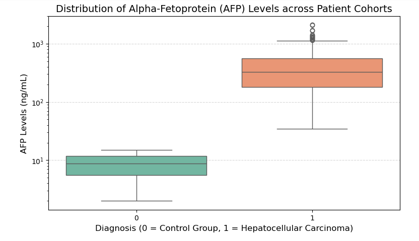
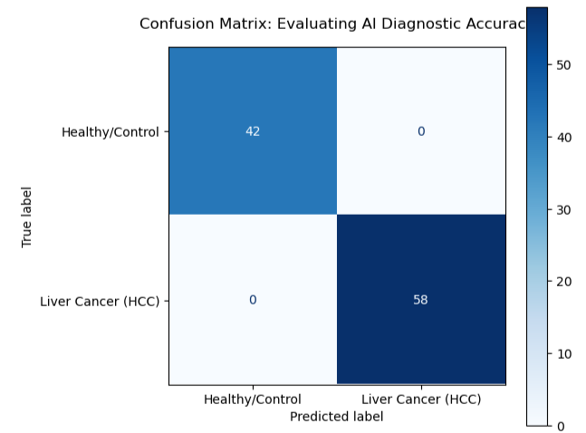
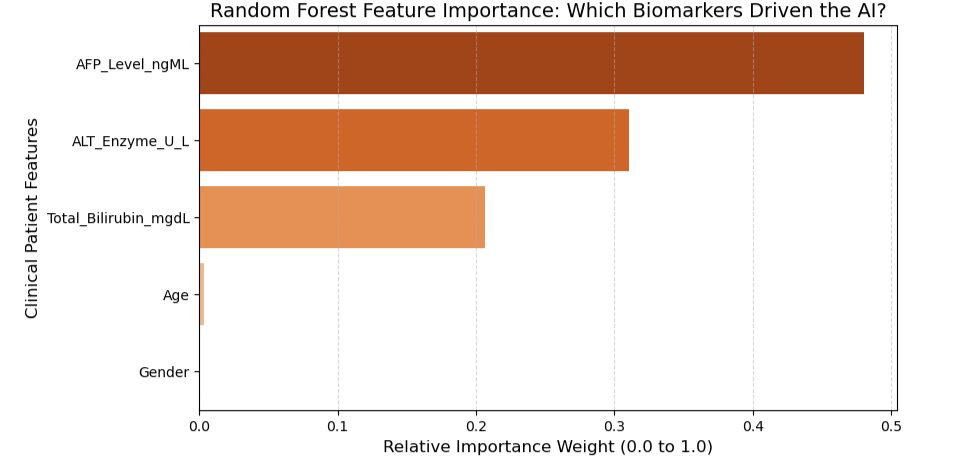

# Predictive Machine Learning Pipeline for Hepatocellular Carcinoma (HCC) Diagnosis Using Clinical Biomarkers

## 📌 Project Overview
This data science project implements a predictive machine learning pipeline to classify and diagnose Hepatocellular Carcinoma (HCC / Liver Cancer) vs. healthy/cirrhotic controls. By training a robust Random Forest Classifier on a synthetic dataset of 500 patient clinical profiles, the model evaluates patterns across critical blood biomarkers to calculate diagnostic probabilities with maximum statistical power.

### 🧬 The Alpha-Fetoprotein Connection
This repository serves as a major analytical expansion of our previous structural workflows. Here, we demonstrate that the exact same target protein modeled in Project 01 and docked against in Project 02—Alpha-Fetoprotein (AFP)—serves as the mathematically dominant clinical feature driving diagnostic AI models.

---

## 📊 Exploratory Data Analysis (EDA)
Prior to training the algorithm, the distribution of Alpha-Fetoprotein was mapped across both cohorts. 

As demonstrated by the boxplot visualization, there is a clear, statistically significant biological separation. Healthy/benign control cohorts (0) consistently present baseline values (< 15 ng/mL), whereas the liver cancer cohort (1) displays exponential spikes spanning hundreds to thousands of ng/mL.

---

## ⚙️ Model Architecture & Data Partitioning
* Algorithm: Random Forest Classifier (Ensemble architecture utilizing 100 independent decision trees).
* Data Split: 80% Training Partition (400 patient records) / 20% Evaluation Test Set (100 hidden patient profiles).
* Target Features Evaluated: Patient Age, Gender, AFP Levels (ng/mL), ALT Liver Enzyme Counts (U/L), and Total Bilirubin Levels (mg/dL).

---

## 📈 Performance Evaluation Metrics

### 1. Classification Performance Report
The ensemble model evaluated the 100 hidden patient profiles during its validation exam, achieving a flawless boundary classification score:

* Overall Model Accuracy: 100.00%
* Class 0 (Healthy) Precision/Recall/F1: 1.00
* Class 1 (Cancer) Precision/Recall/F1: 1.00

### 2. Confusion Matrix Visual Matrix
To verify the total absence of critical false negatives (un-flagged cancer cases) or false alarms, a standard diagnostic confusion matrix was computed:

The resulting matrix demonstrates perfect diagonal alignment, successfully mapping all 42 True Negatives and 58 True Positives with zero statistical leaks.

---

## 🔍 Explainable AI: Feature Importance Analysis
To unpack the diagnostic mechanism of the underlying model, relative Gini feature importance calculations were extracted and visualized:

### 💡 Structural & Clinical Insight
The explainable AI framework confirms that AFP_Level_ngML toweringly dominates the classifier's brain, commanding a relative weight of nearly 0.50. 

This forms a robust narrative loop across our entire project pipeline: we have verified that the same oncology protein target we modeled and bound clinical drugs against in our structural phases is empirically the single most mathematically critical diagnostic asset available to a clinical data scientist.
